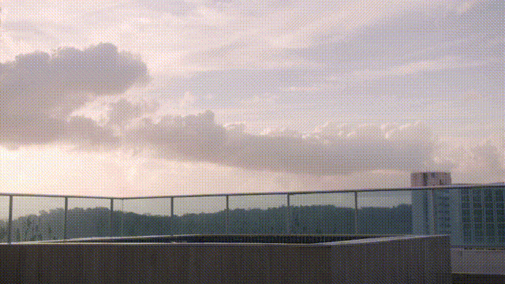

<h1 align="center">
  <span style="color:#2196f3;"><b>EraserDiT</b></span>: Fast Video Inpainting with Diffusion Transformer Model
</h1>

<p align="center">
  <a href="https://huggingface.co/jieeliu/EraserDiT"></a>
  <a href="https://github.com/JieLiu95/EraserDiT"></a>
  <a href="https://arxiv.org/abs/2506.12853"></a>
  <a href="https://jieliu95.github.io/EraserDiT_demo/"></a>
</p>

## 原始算法：[EraserDiT](https://github.com/JieLiu95/EraserDiT)

可根据指定区域擦除视频中的物体，并恢复背景内容与时序一致性。

| 输入视频 | 擦除结果 |
| :---: | :---: |
|  |  |

## 本仓库：面向算法的推理 infra

本仓库基于 [原始 EraserDiT 算法](https://github.com/JieLiu95/EraserDiT)，提供**更低显存、更快推理和可部署的视频擦除服务**：输入视频、掩码与背景提示词，即可通过 CLI、批量任务或 HTTP API 完成擦除。

实现参考 SGLang 的 `python/sglang/multimodal_gen`，可理解为面向 EraserDiT 的 **mini SGLang 多模态推理运行时**。所需能力在仓库内实现，便于在**算法环境中维护依赖兼容性**，无需安装 SGLang；模块划分清晰，便于**阅读、调试、二次开发**。

### 已实现的优化

| 方向 | 实现 |
| --- | --- |
| **显存优化** | 整组件分阶段卸载；DiT 逐层卸载、pinned CPU 权重、独立 CUDA stream 预取与权重预算；阶段边界回收空闲显存缓存 | 
| **视频内存** | 按窗口执行与帧缓存释放；可选流式读取、VAE 分块 | 
| **单卡计算** | SDPA / FlashAttention / SageAttention 后端；`torch.compile`；Triton RMSNorm + AdaLN、QK RMSNorm + RoPE 融合；文本投影复用 | 
| **多卡单任务** | CFG 正负分支并行、SP 序列并行、VAE 编解码并行及 CFG × SP 组合 | 
| **多卡多任务** | DP dispatcher 将独立视频分配给不同 worker | 
| **TeaCache / CacheDiT** | 根据步间变化复用 Transformer 残差；按窗口和 CFG 分支隔离缓存；预热、末步保护与连续跳步限制 | 
| **实验性量化** | DiT Linear 的 INT8 W8A8，支持 blocks / FFN 范围 |

### 实测结果

A100 80GB，1920 × 1080、121 帧，BF16、seed=42、50 步、strength=0.8；一个窗口执行 40 个去噪步。

| 配置 | GPU 数 | 耗时 ↓ | 加速比 ↑ | 总峰值显存 ↓ |
| --- | ---: | ---: | ---: | ---: |
| 原算法复现基线 | 1 | 213.00 s | 1.00× | 69.33 GiB |
| 逐层卸载 | 1 | 215.04 s | 0.99× | 33.64 GiB |
| 逐层卸载 · CFG2 · SDPA | 2 | 131.73 s | 1.62× | 37.37 GiB |
| 逐层卸载 · SP2 · SDPA | 2 | 133.15 s | 1.60× | 36.59 GiB |
| **逐层卸载 · CFG2 · Sage · TeaCache（推荐）** | **2** | **89.87 s** | **2.37×** | **37.90 GiB** |
| 逐层卸载 · SP2 · FA · cache_dit | 2 | 97.28 s | 2.19× | 36.56 GiB |
| 组件阶段卸载 · CFG2 · SDPA | 2 | 127.01 s | 1.68× | 40.50 GiB |
| 组件阶段卸载 · CFG2 · Sage · TeaCache | 2 | 83.45 s | 2.55× | 41.02 GiB |
| 逐层卸载 · CFG2 · INT8 · SDPA · cache_dit | 2 | 85.66 s | 2.49× | 38.07 GiB |

## 快速开始

### 1. 安装

需要 Linux、NVIDIA GPU 和已安装的 `uv`，环境准备见 [安装说明](docs/setup.md)。

```bash
sudo apt-get install -y git curl ffmpeg libgl1 libglib2.0-0

git clone https://github.com/MGTVAI/EraserDiT.git
cd EraserDiT
uv venv --python 3.10
uv pip install --python .venv/bin/python --index-strategy unsafe-best-match -r requirements.txt
```

### 2. 下载模型

从 [Hugging Face](https://huggingface.co/jieeliu/EraserDiT) 下载完整模型到 `data/model/`：

```bash
HF_ENDPOINT=https://hf-mirror.com HF_HUB_DISABLE_XET=1 \
uv run --no-project hf download jieeliu/EraserDiT \
  --revision 904fb412da76235085dbbccaefdbde4979fa3d29 \
  --local-dir data/model \
  --exclude ".DS_Store"
```

### 3. 运行

以下命令使用仓库中的示例视频和掩码，结果写入 `outputs/result.mp4`：

```bash
mkdir -p outputs
CUDA_VISIBLE_DEVICES=0 HF_HUB_OFFLINE=1 uv run --no-project python -m entrypoints.cli.erase_eraserdit \
  --model-path data/model \
  --video-input data/113000356.mp4 --mask-input data/113000356_mask.mp4 \
  --output-path outputs/result.mp4 \
  --prompt "There is a rooftop terrace overlooking the city at sunset." \
  --attention-backend sdpa \
  --resource-policy dynamic_offload
```

## 常用优化配置

双卡推荐组合（需安装 SageAttention，允许缓存近似）：

```bash
CUDA_VISIBLE_DEVICES=0,1 HF_HUB_OFFLINE=1 uv run --no-project python -m entrypoints.cli.erase_eraserdit \
  --model-path data/model \
  --video-input data/113000356.mp4 --mask-input data/113000356_mask.mp4 \
  --output-path outputs/result_cfg2.mp4 \
  --prompt "There is a rooftop terrace overlooking the city at sunset." \
  --attention-backend sage_attn --resource-policy dynamic_offload \
  --cfg-degree 2 --enable-torch-compile \
  --transformer-cache-mode teacache --teacache-threshold 0.3 --cache-text-projections
```

## 启动服务

```bash
CUDA_VISIBLE_DEVICES=0 HF_HUB_OFFLINE=1 uv run --no-project python -m entrypoints.server.serve \
  --pipeline-name EraserDiTErasePipeline --model-path data/model \
  --task-root outputs/service --input-allowed-root "$PWD/data" \
  --host 127.0.0.1 --port 30000
```

## 文档

| 文档 | 内容 |
| --- | --- |
| [安装与部署](docs/setup.md) | 新机器安装、模型下载、可选依赖、容器和排错 |
| [命令行推理](docs/cli.md) | 单视频、批量任务、参数与多卡入口 |
| [服务 API](docs/service_api.md) | 服务配置、请求、任务和结果 |
| [性能配置](docs/performance.md) | 注意力、编译、卸载、缓存、并行与量化 |
| [配置说明](config/README.md) | 模型、服务与运行配置 |
| [代码架构](docs/architecture.md) | 模块职责、执行流程与依赖边界 |
| [逐层卸载](docs/layerwise_offload.md) | CPU/GPU 权重存储、异步预取与预算管理 |

## 下一步工作

消费级显卡适配、WebUI / ComfyUI、单卡与多卡性能、缓存质量调优和 FP8 量化。具体计划见 [开发路线](docs/roadmap.md)。

## 参考仓库

- [EraserDiT](https://github.com/JieLiu95/EraserDiT)：模型与视频擦除算法。
- [SGLang multimodal_gen](https://github.com/sgl-project/sglang/tree/main/python/sglang/multimodal_gen)：多模态推理运行时、服务与逐层卸载设计参考。

## 本仓库开发人员（按贡献度排名）

- [ZhiHeng66](https://github.com/ZhiHeng66)
- [balbalabal](https://github.com/balbalabal)
- [Alwaysssssss](https://github.com/Alwaysssssss)

## 📜 Citation

If you find our work helpful, please consider giving a star 🌟 and citation 📝

```
@article{liu2025eraserdit,
  title={EraserDiT: Fast Video Inpainting with Diffusion Transformer Model},
  author={Liu, Jie and Hui, Zheng},
  journal={arXiv preprint arXiv:2506.12853},
  year={2025}
}
```
