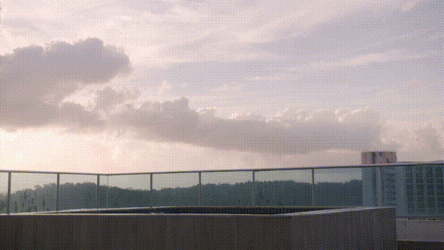

<h1 align="center">EraserDiT：面向 L40S 的视频擦除推理与服务</h1>

<p align="center">
  <a href="https://huggingface.co/jieeliu/EraserDiT">模型权重</a> ·
  <a href="https://github.com/JieLiu95/EraserDiT">原始算法</a> ·
  <a href="https://arxiv.org/abs/2506.12853">论文</a> ·
  <a href="https://jieliu95.github.io/EraserDiT_demo/">算法演示</a>
</p>

输入视频、对应掩码和背景提示词，擦除指定区域并生成背景。本仓库基于原始 EraserDiT，
提供 CLI、批量调度、HTTP API 与浏览器 WebUI；推理运行时参考 SGLang multimodal_gen，在仓库内实现，无需安装 SGLang。

| 输入视频 | 擦除结果 |
| :---: | :---: |
|  |  |

## L40S 如何选配置

- **一张卡**：BF16/SDPA、DiT 组件卸载，适合单机起步。
- **两张卡处理一个视频**：NCCL CFG2，同时计算两个去噪分支。
- **四张卡处理一个视频**：CFG2×SP2 `reference` 加输出通信重叠，是已验收的最低单请求延迟。

以上推荐均使用 BF16、SDPA、原始分辨率和帧数，关闭近似缓存、量化和尾窗减填充。

## 性能数据与复测计划

实测与待复测项合并在同一张表。固定使用 `data/113000356.mp4` 及对应 mask：
1920×1080、145 帧、24000/1001 fps；prompt 为 `There is a bridge over the lake.`，seed 42、
CFG 3、50 步×strength 0.8（每窗口实际 40 步）、121 帧窗口、9 帧重叠、完整尾窗填充。
每项连续完成 2 次请求；请求包含读取、预处理、推理、后处理和保存，不含模型加载与显式预热。

所有耗时列单位均为秒，各列分别从原始 2 次记录取中位数，不能用分项之和反推请求时间。
“整片加速”统一以 S3 单卡 BF16 为 1.00×。所有待测项都执行，不设置性能或质量门禁；
失败项保留错误阶段与资源记录。完整配置和原始数据要求见
[性能复测方案](docs/performance_retest_plan_20261004.md)。

| 测试 | GPU | 配置 | 请求中位数（范围） | 纯模型推理 | 文本编码 | VAE 编码 | DiT 去噪 | VAE 解码 | 整片加速 |
| --- | ---: | --- | ---: | ---: | ---: | ---: | ---: | ---: | ---: |
| B0 | 1 | 原始算法，全驻留 BF16/SDPA | —（VAE 编码 OOM，待复现） | — | — | OOM | — | — | — |
| B1 | 1 | 原始算法，CPU offload + VAE tiling | 待测 | 待测 | 待测 | 待测 | 待测 | 待测 | 待测 |
| S0 | 1 | 当前源码，preload + 逐层卸载，关闭融合 | 待测 | 待测 | 待测 | 待测 | 待测 | 待测 | 待测 |
| S1 | 1 | S0 + 窗口流式 I/O + uint8 帧缓存 | 待测 | 待测 | 待测 | 待测 | 待测 | 待测 | 待测 |
| S2 | 1 | S1 改为 DiT 组件卸载 | 待测 | 待测 | 待测 | 待测 | 待测 | 待测 | 待测 |
| S3 / C0 / Q0 | 1 | S2 + 精确 QK RoPE / AdaLN 融合 | 420.23（418.91–420.54） | 392.37 | 1.06 | 16.69 | 364.10 | 10.57 | 1.00× |
| M1 | 2 | NCCL CFG2 | 241.17（240.02–242.36） | 215.57 | 1.08 | 16.33 | 187.67 | 10.61 | 1.74× |
| M2 | 2 | NCCL SP2 `reference` | 待测 | 待测 | 待测 | 待测 | 待测 | 待测 | 待测 |
| M3 | 4 | CFG2×SP2 `reference` | 207.82（204.69–208.74） | 182.81 | 1.08 | 16.47 | 154.40 | 10.43 | 2.02× |
| M4 | 4 | M3 + 输出通信重叠，head 分块 4 | 195.93（195.27–196.31） | 170.42 | 1.08 | 16.51 | 142.03 | 10.69 | 2.14× |
| V0 | 2 | CFG2 + VAE1 | 待测 | 待测 | 待测 | 待测 | 待测 | 待测 | 待测 |
| V1 | 2 | CFG2 + VAE2 | 待测 | 待测 | 待测 | 待测 | 待测 | 待测 | 待测 |
| V2 | 2 | SP2 `reference` + VAE1 | 待测 | 待测 | 待测 | 待测 | 待测 | 待测 | 待测 |
| V3 | 2 | SP2 `reference` + VAE2 | 待测 | 待测 | 待测 | 待测 | 待测 | 待测 | 待测 |
| V4 | 4 | CFG2×SP2 `reference` + VAE1 | 待测 | 待测 | 待测 | 待测 | 待测 | 待测 | 待测 |
| V5 | 4 | CFG2×SP2 `reference` + VAE4 | 待测 | 待测 | 待测 | 待测 | 待测 | 待测 | 待测 |
| C1 | 1 | TeaCache 0.01 | 待测 | 待测 | 待测 | 待测 | 待测 | 待测 | 待测 |
| C2 | 1 | TeaCache 0.1 | 待测 | 待测 | 待测 | 待测 | 待测 | 待测 | 待测 |
| C3 | 1 | TeaCache 0.3 | 待测 | 待测 | 待测 | 待测 | 待测 | 待测 | 待测 |
| C4 | 1 | CacheDiT 0.02 | 待测 | 待测 | 待测 | 待测 | 待测 | 待测 | 待测 |
| C5 | 1 | CacheDiT 0.1 | 待测 | 待测 | 待测 | 待测 | 待测 | 待测 | 待测 |
| C6 | 1 | CacheDiT 0.3 | 待测 | 待测 | 待测 | 待测 | 待测 | 待测 | 待测 |
| Q1 | 1 | INT8 FFN + SDPA + 精确融合 | 待测 | 待测 | 待测 | 待测 | 待测 | 待测 | 待测 |
| Q2 | 1 | 动态 FP8 FFN + SDPA + 精确融合 | 待测 | 待测 | 待测 | 待测 | 待测 | 待测 | 待测 |
| Q3 | 1 | 静态 FP8 FFN + SDPA + 精确融合 | 待测 | 待测 | 待测 | 待测 | 待测 | 待测 | 待测 |
| Q4 | 1 | Q3 + Sage FP8 attention | 待测 | 待测 | 待测 | 待测 | 待测 | 待测 | 待测 |
| Q5 | 1 | Q4 + 快速 QK RoPE | 待测 | 待测 | 待测 | 待测 | 待测 | 待测 | 待测 |
| Q6 | 1 | Q5 + 快速 AdaLN / gated residual | 待测 | 待测 | 待测 | 待测 | 待测 | 待测 | 待测 |

已有四组共 20 个请求。纯模型推理及四个阶段数值由正式报告逐项独立取中位数；VAE 编码对应
`ConditionEncodingStage`，VAE 解码对应 `DecodingStage`。通信重叠相对 M3 将请求中位数缩短
5.72%，将 DiT 中位数缩短 8.02%。详细显存、批量吞吐和既有输出核验见
[L40S 验收记录](docs/l40s_validation_20261004.md)。

## 快速开始

以下命令从仓库根目录执行，使用 **Bash**；运行配置使用数组，请在同一终端中执行。
通用 CLI 默认使用逐层卸载；以下命令显式选择已验证的组件卸载、融合和多卡模式。

### 1. 安装依赖与下载模型

需要 Linux、NVIDIA 驱动、CUDA 12.6 Toolkit（含 `nvcc`）和 uv。
完整依赖包含需要构建的 FlashAttention；推荐 BF16/SDPA 无需额外构建 Sage FP8 扩展。
环境要求与排错见 [安装说明](docs/setup.md)。

```bash
git clone https://github.com/MGTVAI/EraserDiT.git
cd EraserDiT
sudo apt-get install -y git curl build-essential ffmpeg libgl1 libglib2.0-0
nvcc --version
uv venv --python 3.10
uv pip install --python .venv/bin/python --index-strategy unsafe-best-match \
  --extra-index-url https://download.pytorch.org/whl/cu126 \
  torch==2.6.0+cu126 pip setuptools wheel packaging ninja psutil
MAX_JOBS=4 uv pip install --python .venv/bin/python --index-strategy unsafe-best-match \
  --no-build-isolation-package flash-attn -r requirements.txt
uv pip check --python .venv/bin/python
HF_HUB_OFFLINE=0 uv run --no-project hf download jieeliu/EraserDiT \
  --revision 904fb412da76235085dbbccaefdbde4979fa3d29 \
  --local-dir data/model --exclude ".DS_Store"
```

### 2. 设置共同运行参数

模型完整下载后可离线运行。示例掩码中白色表示擦除、黑色表示保留；
自有视频掩码需匹配输入尺寸、帧率与帧数。提示词描述擦除后的背景。

```bash
mkdir -p outputs
export HF_HUB_OFFLINE=1 OMP_NUM_THREADS=8 MKL_NUM_THREADS=8
export PYTORCH_CUDA_ALLOC_CONF=expandable_segments:True
export MGERASE_NCCL_PACKING=direct MGERASE_DIT_BOUNDARY_TRANSPORT=cpu
export MGERASE_POSTPROCESS_CHUNKED_FP32=1 MGERASE_VAE_INPLACE_ACTIVATIONS=1
export MGERASE_VAE_OFFLOAD_MODE=cached MGERASE_FFMPEG_THREADS=auto
export MGERASE_ULYSSES_HEAD_CHUNKS=1 MGERASE_ULYSSES_OUTPUT_OVERLAP=0

RUNTIME=(
  --model-path data/model
  --no-dit-layerwise-offload --text-encoder-cpu-offload --vae-cpu-offload
  --vae-low-memory --cuda-memory-limit-gib 22
  --runtime-mode windowed_streaming --streaming-cache-dtype uint8
  --infer-len 121 --overlap 9 --no-compact-tail-padding
  --attention-backend sdpa
  --operator-fusion-backend triton --operator-fusion-ops qk_rmsnorm_rope,rmsnorm_adaln
  --num-inference-steps 50 --strength .8 --guidance-scale 3 --seed 42
  --transformer-cache-mode off --no-cache-text-projections
  --warmup --warmup-steps 2
)
VIDEO=(
  --video-input data/113000356.mp4 --mask-input data/113000356_mask.mp4
  --prompt "There is a bridge over the lake."
)
```

### 3. 选择单卡、双卡或四卡

单卡使用 DiT 组件卸载：

```bash
CUDA_VISIBLE_DEVICES=0 uv run --no-project python -m entrypoints.cli.erase_eraserdit \
  "${RUNTIME[@]}" "${VIDEO[@]}" --dit-cpu-offload --output-path outputs/l40s-1.mp4
```

双卡使用独立 NCCL CFG2：

```bash
CUDA_VISIBLE_DEVICES=0,1 uv run --no-project python -m entrypoints.cli.erase_eraserdit \
  "${RUNTIME[@]}" "${VIDEO[@]}" --no-dit-cpu-offload \
  --dit-parallel-backend nccl --cfg-degree 2 --output-path outputs/l40s-2.mp4
```

四卡每个 CFG 分支用两卡做序列并行。`reference` 保留已验证的数值行为；
输出通信重叠环境变量只作用于此命令：

```bash
CUDA_VISIBLE_DEVICES=0,1,2,3 MGERASE_ULYSSES_HEAD_CHUNKS=4 MGERASE_ULYSSES_OUTPUT_OVERLAP=1 \
uv run --no-project python -m entrypoints.cli.erase_eraserdit \
  "${RUNTIME[@]}" "${VIDEO[@]}" --no-dit-cpu-offload \
  --dit-parallel-backend nccl --cfg-degree 2 --sp-degree 2 --sp-linear-mode reference \
  --output-path outputs/l40s-4.mp4
```

## WebUI 与 HTTP 服务

沿用前面的环境设置，单卡启动：

```bash
CUDA_VISIBLE_DEVICES=0 uv run --no-project python -m entrypoints.server.serve \
  --model-path data/model --task-root outputs/service --host 127.0.0.1 --port 30000 \
  --no-dit-layerwise-offload --dit-cpu-offload --text-encoder-cpu-offload --vae-cpu-offload \
  --vae-low-memory --cuda-memory-limit-gib 22 --runtime-mode windowed_streaming \
  --attention-backend sdpa --operator-fusion-backend triton \
  --operator-fusion-ops qk_rmsnorm_rope,rmsnorm_adaln --warmup --warmup-steps 2
```

打开 `http://127.0.0.1:30000/ui`，上传视频和mask，或使用画笔绘制静态擦除区域，
填写背景提示词后提交。页面支持预览、进度、取消与结果下载；静态画笔不跟踪移动物体。
HTTP 请求、允许读取的本地路径及任务管理见 [服务API](docs/service_api.md)。
浏览器流程已验证；真实 L40S 的取消后恢复测试使用320×240、12帧输入，不作为1080p服务性能结论。

## 验证与复现

本轮 CPU 回归253项中173通过、80按环境条件跳过；另完成 GPU 卸载、量化搬运、通信流水与故障恢复专项验证。
正式性能测试冻结推理源码，记录输入/模型指纹、环境、逐卡进程采样、完整输出和 worker 分配。
四组单视频正式配置共 20 条请求的输出、视频规格、显存、退出状态与源码一致性核验均通过。

可用统一入口复测；每次选择新的结果目录，其他 profile 参数见 [验证说明](docs/validation.md)：

```bash
uv run --no-project python -m entrypoints.cli.benchmark_l40s \
  --profile bf16_fused --devices 0 --repeats 5 --run-dir results/my-l40s-1
```

| 文档 | 内容 |
| --- | --- |
| [L40S验收记录](docs/l40s_validation_20261004.md) | 本轮完整条件、质量筛选、性能与显存结果 |
| [安装部署](docs/setup.md) | 依赖、模型、可选扩展、容器与排错 |
| [CLI说明](docs/cli.md) / [服务API](docs/service_api.md) | 参数、任务文件、服务接口 |
| [性能配置](docs/performance.md) | 卸载、attention、融合、缓存、量化与并行边界 |
| [架构](docs/architecture.md) / [配置](config/README.md) | 代码组织、执行流程与配置职责 |
| [文档索引](docs/README.md) / [路线图](docs/roadmap.md) | 历史实验与后续方向 |

## 来源、贡献者与许可

模型与视频擦除算法来自 [EraserDiT](https://github.com/JieLiu95/EraserDiT)。
运行时、服务和卸载设计参考 [SGLang multimodal_gen](https://github.com/sgl-project/sglang/tree/main/python/sglang/multimodal_gen)。
本仓库许可证为 [Apache-2.0](LICENSE)。

本仓库开发人员（按贡献度排名）：[ZhiHeng66](https://github.com/ZhiHeng66)、
[balbalabal](https://github.com/balbalabal)、[Alwaysssssss](https://github.com/Alwaysssssss)。

```bibtex
@article{liu2025eraserdit,
  title={EraserDiT: Fast Video Inpainting with Diffusion Transformer Model},
  author={Liu, Jie and Hui, Zheng},
  journal={arXiv preprint arXiv:2506.12853},
  year={2025}
}
```
